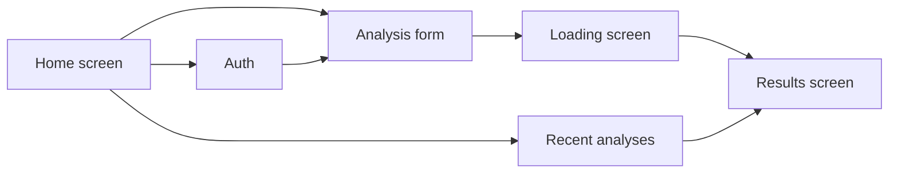

# Frontend

React + Vite client for ooppssie. This application handles authentication screens, analysis form submission, result rendering, and navigation through saved reports. The admin panel is served by the same bundle at `/adminpanel`.

## Responsibilities

- register and login forms
- token storage in the browser
- profile analysis submission
- error rendering from the real API
- recent analyses list
- reopening saved reports
- admin dashboard at `/adminpanel` with filters, analytics, logs, and Socket.IO realtime updates

## UI flow



## Stack

| Area | Tooling |
| --- | --- |
| App | React 19 |
| Bundler | Vite |
| Styling | Tailwind CSS |
| Icons | lucide-react |
| Type safety | TypeScript |

## Environment

Create `frontend/.env`:

```env
VITE_API_URL=http://127.0.0.1:5000
```

Production example:

```env
VITE_API_URL=https://your-domain.com/api
```

## Commands

```bash
cd frontend
npm install
npm run dev
npm run lint
npm run test
npm run build
```

## Build output

The production bundle is generated in:

```text
frontend/dist
```

That folder should be served by Nginx or another static file server.

## Production notes

- Set `VITE_API_URL` before running `npm run build`
- Rebuild the frontend after every environment change
- If you deploy frontend and backend on the same domain, prefer `/api` proxying through Nginx
- Proxy Socket.IO traffic for the admin panel as well (`/socket.io/`, or `/api/socket.io/` when using the Vite `/api` proxy)
- If the app loads but API requests fail, verify the built frontend points to the correct API base URL

For the full server deployment guide, see the root [README](../README.md).
